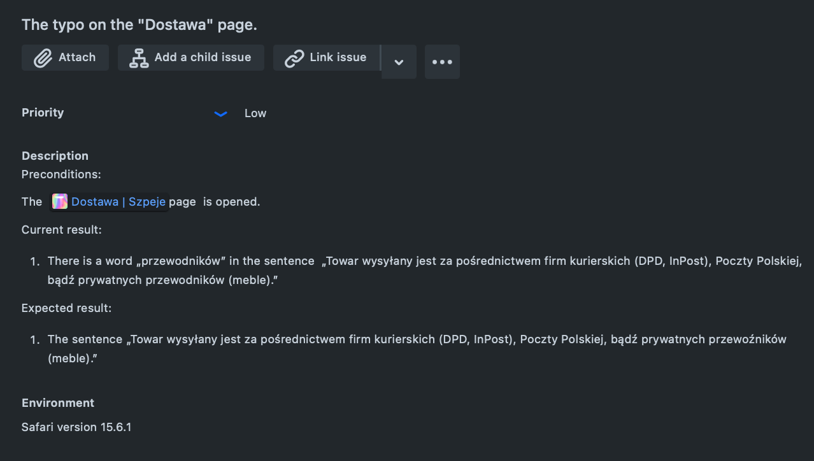

# manual_testing_portfolio

### Sample bug reports for www.szpeje.com website:

1. Content

2. Content

3. Content

4. Content

5. (failed test case - C11)
.png)
[SZPEJ-5 attachment](https://github.com/spookTacularLDN43/manual_testing_portfolio/blob/6ebd7cf0cc8403a1587c5d36fe90252225d78e1a/Screen%20rec-%20SZPEJ-5.mp4)

### Sample test cases for www.szpeje.com website:

1. Status - passed.

2. Status - failed. 

